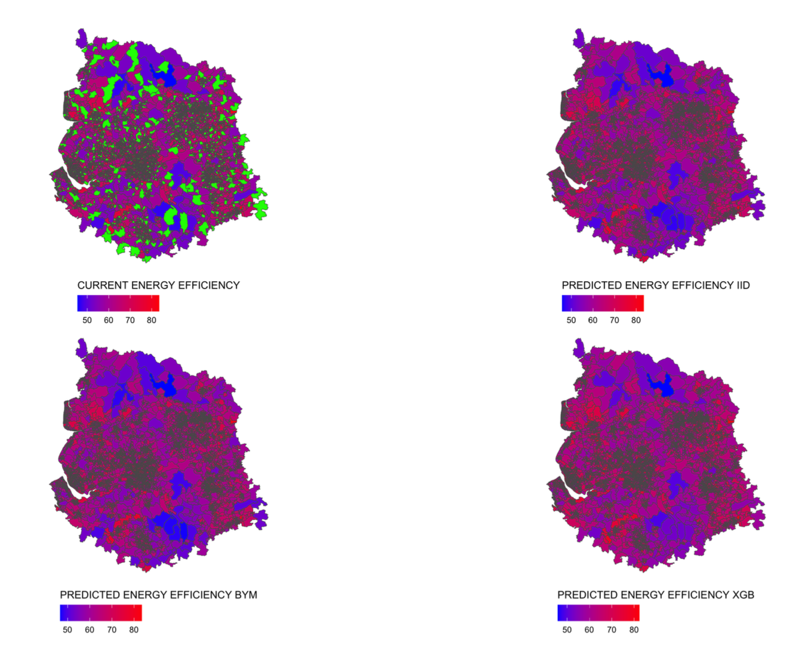
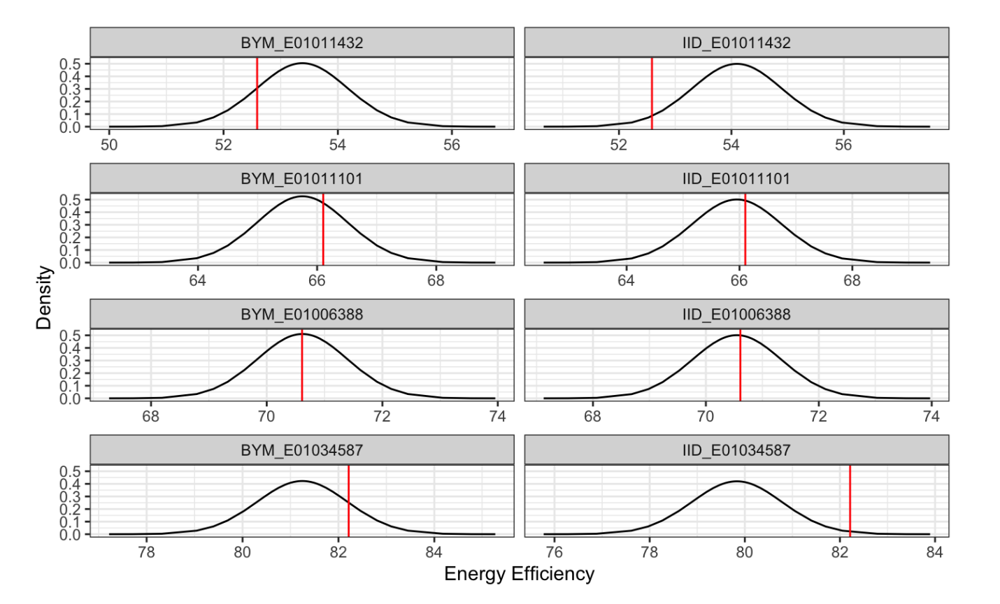

# Bayesian Spatial Energy Modeling
**National-scale Geostatistical Analysis of 3M+ Domestic Properties using INLA & Gaussian Random Fields.**

## Academic Research Archive
**Note:** This repository hosts the Master's Dissertation submitted for the MSc in Data Science at Lancaster University, which received a Distinction.

**Research Focus:** This study compares advanced Bayesian Spatial Modeling techniques (specifically R-INLA) against industry-standard Machine Learning algorithms (XGBoost) for predicting Energy Performance Certificate (EPC) ratings across the UK housing stock.

## Challenge: Spatial Autocorrelation in Real Estate Data
Standard Machine Learning models, such as Linear Regression or Random Forests, operate under the assumption that data points are Independent and Identically Distributed (I.I.D). In geospatial contexts, this assumption is fundamentally violated. A property's energy efficiency is often highly correlated with its neighbors due to shared construction periods, materials, and environmental factors.

As visualized in the **Spatial Error Analysis** below, prediction errors from non-spatial models are not randomly distributed; they cluster geographically. Ignoring this "Spatial Autocorrelation" leads to biased predictions and unreliable confidence intervals.

## Methodology
To address these limitations, I developed a **Besag-York-Mollié (BYM)** model using **Integrated Nested Laplace Approximation (INLA)**. This approach decomposes the spatial field into two distinct components:
1.  **Structured Spatial Effects:** Capturing the dependency between a specific location and its neighbors (Spatial Autocorrelation).
2.  **Unstructured Noise:** Capturing the random variance inherent in the data (Heterogeneity).

Unlike Markov Chain Monte Carlo (MCMC) methods, which can be computationally prohibitive on large datasets, INLA allows for approximate Bayesian inference that scales efficiently to millions of data points.

### Technical Framework
- **Statistical Inference:** Bayesian Inference via R-INLA package.
- **Machine Learning Benchmark:** XGBoost (Gradient Boosting Trees) for feature importance analysis.
- **Data Scale:** Approximately 3 million records of UK Energy Performance Certificates.
- **Geospatial Tools:** GIS shapefiles (LSOA level aggregation), Variograms for spatial dependence testing.

## Key Results & Impact

The study demonstrated that while XGBoost is effective at capturing non-linear relationships between building features, it fails to account for location-dependent variance. The Bayesian Spatial Model significantly outperformed the baseline by explicitly modeling these geographic dependencies.

| Model Architecture | MSE (Mean Squared Error) | Verdict |
| :--- | :--- | :--- |
| **IID Model (Baseline)** | 1.20 | **Poor.** Fails to capture spatial context. |
| **XGBoost (ML)** | 1.10 | **Good.** Captures non-linear feature relationships effectively. |
| **BYM Spatial Model (INLA)** | **0.78** | **Superior.** Achieved a 29% reduction in error compared to XGBoost. |

### Uncertainty Quantification
A critical advantage of the Bayesian approach over standard Machine Learning point predictions is the ability to generate **Posterior Probability Distributions**.

This allows policymakers to view the full predictive distribution for any given region, providing a confidence interval that quantifies the risk and uncertainty associated with energy efficiency estimates.

## Read the Full Dissertation
This document details the complete mathematical framework, rigorous feature selection process, and extensive residual analysis used to validate the models.

[**Download Full Research Paper (PDF)**](epc_prediction_dissertation_project.pdf)
