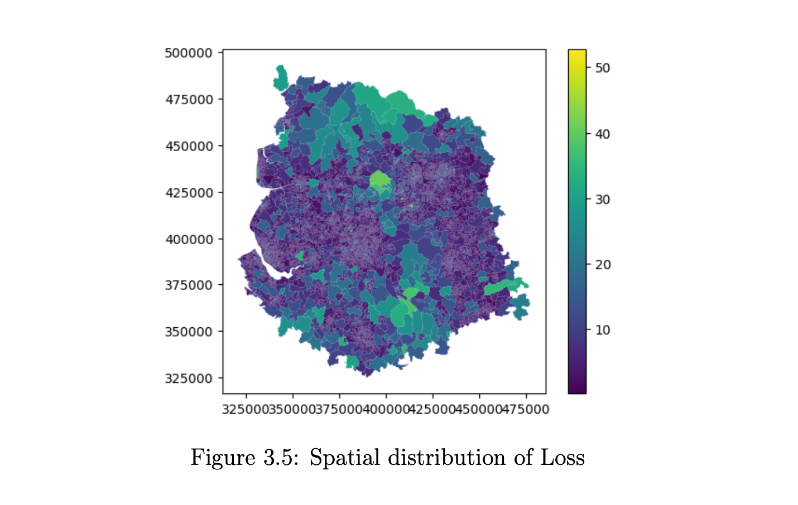

#  Bayesian Spatial Energy Modeling
**National-scale Geostatistical Analysis of 3M+ Domestic Properties using INLA & Gaussian Random Fields.**

## Academic Research Archive
> **Note:** This repository hosts the Master's Dissertation submitted for the MSc in Data Science at Lancaster University (Distinction).
>
> **Focus:** Advanced Bayesian Spatial Modeling (R-INLA) vs. Machine Learning (XGBoost) for predicting energy efficiency in the UK housing stock.

## 🔬 The Problem: Spatial Autocorrelation
Standard Machine Learning models (like Linear Regression or Random Forests) assume that data points are independent. In real estate and geography, this is false: **a house's energy efficiency is highly correlated with its neighbors.**

Ignoring this "Spatial Autocorrelation" leads to biased predictions and weak policy insights.

## 🛠️ Methodology
I developed a **Besag-York-Mollié (BYM)** model using **Integrated Nested Laplace Approximation (INLA)** to capture both:
1.  **Structured Spatial Effects:** How a neighborhood influences a specific house.
2.  **Unstructured Noise:** Random variance inherent in the data.

### Tech Stack
- **Statistical Framework:** Bayesian Inference (R-INLA).
- **Machine Learning Benchmark:** XGBoost (Gradient Boosting).
- **Data Scale:** ~3 Million records (UK Energy Performance Certificates).
- **Geospatial Tools:** GIS shapefiles (LSOA level), Variograms.

##  Key Results & Impact

The Bayesian Spatial Model significantly outperformed the industry-standard Machine Learning approach by correctly modeling the geographic dependencies.

| Model Architecture | MSE (Mean Squared Error) | Verdict |
| :--- | :--- | :--- |
| **IID Model (Baseline)** | 1.20 | **Poor.** Ignores spatial context. |
| **XGBoost (ML)** | 1.10 | **Good.** Captures non-linear feature relationships. |
| **BYM Spatial Model (INLA)** | **0.78** | **Superior.** 29% Error reduction vs XGBoost. |

### Uncertainty Quantification
Unlike XGBoost, which gives a single point prediction, the Bayesian approach provides **Posterior Probability Distributions**. This allows policymakers to see the *confidence interval* for every single region (as seen below), enabling better risk management.

##  Read the Full Dissertation
This document details the complete mathematical framework, rigorous feature selection, and residual analysis.

[**Download Full Research Paper (PDF)**](Energy_Performance_Geostatistical_Approach.pdf)
